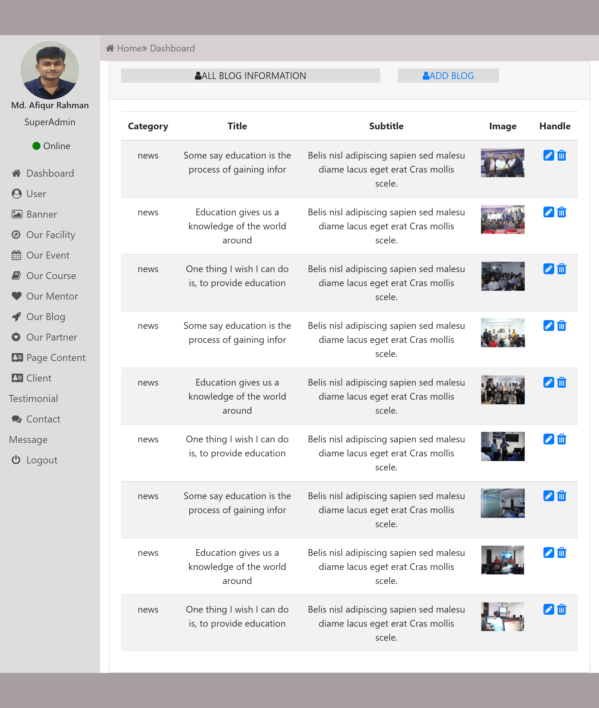

<h2>PHP Dynamic Websites: <a href="http://rafihossain.epizy.com/?i=1">Live View</a></h2>

•	Dynamically control fully website using admin panel.
•	Add and edit slider images and contents.
•	Admin can update their profile.
•	Logout, user, authentication features.
•	User role system, superadmin, admin, subscriber.
Technology Used:
	PHP, MySQl, JQuery, Html, Css, Bootstrap

visite website: http://rafihossain.epizy.com/?i=1
<h3>Project Screenshot</h3>
  
  
  
  
  